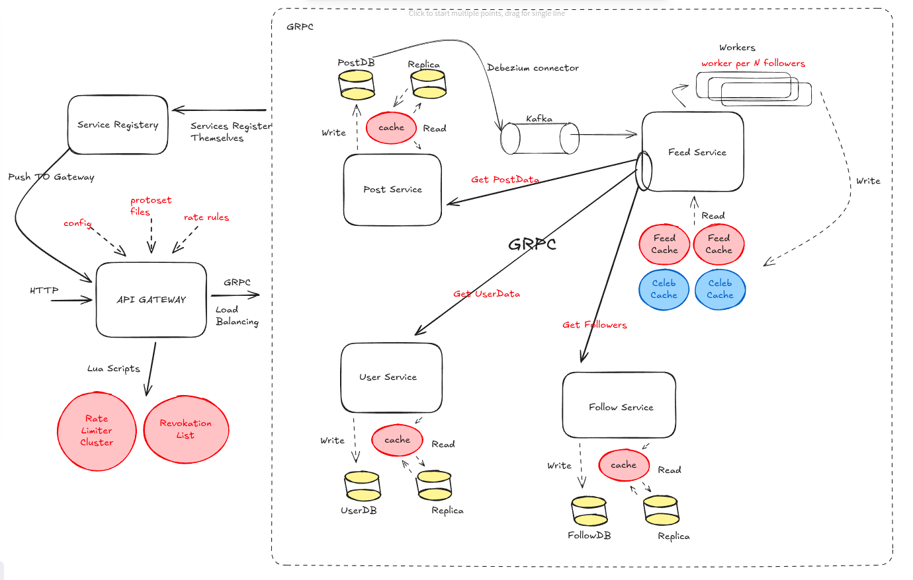
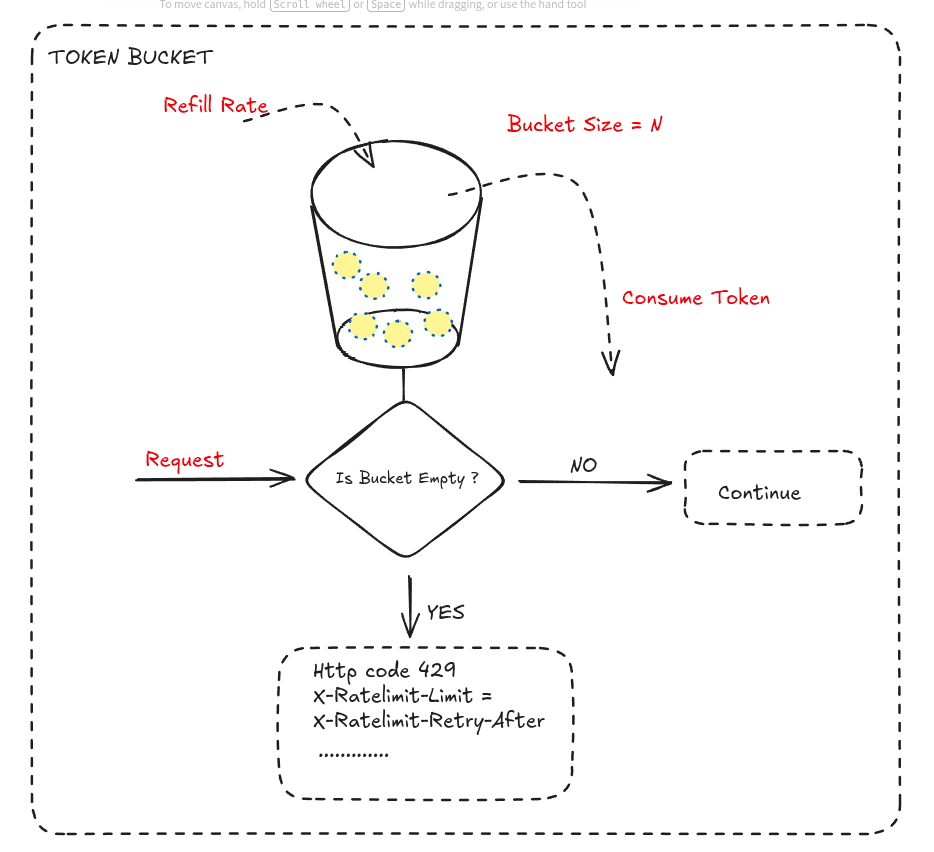
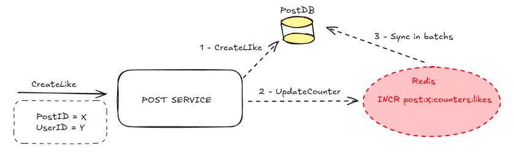
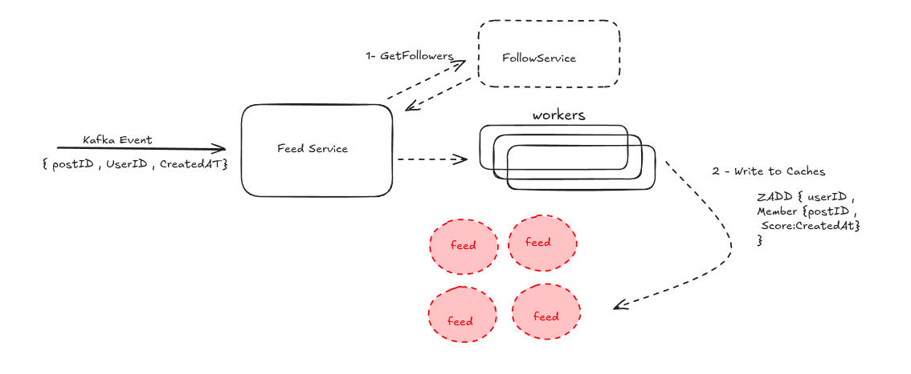
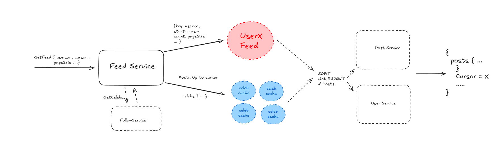

# Overview

There’s a common saying in the industry that the first rule of microservices is: **don’t do microservices**. The idea is that if you can avoid the complexity, you probably should. In this repository, I do them anyway (even if it is just a mini example) — but with a focus on understanding the real cost and learning.

This Readme will be more like a blog, sharing notes, ideas and what I have done logically to create the project. not too much about the code. today’s AI era the easiest thing to do is understand most of the code. 

The process is incremental and consists of several stages:

- Service Design
  - Design and implement the services.

- Deployment on AWS EKS
  - **Terraform**: Create the infrastructure.
  - **Terragrunt**: Manage DEV and PROD environments.
  - **CI Pipeline**
    - Run tests
    - Build container images
    - Push images to registry
  - **ArgoCD**
    - Enable GitOps-based deployment


---------------------------------------------

**Work is in progress. Iterations will be pushed as the system evolves.**

---------------------------------------------

## Services

The project is a social media platfrom includes multiple services from scratch written in **Go** and **Spring Boot**, including:

- `api_gateway`
- `post_service`
- `follow_service`
- `feed_service`
- `user_service`


## Table of Contents

- [API Gateway](#api-gateway)
  - [Rate Limiting](#rate-limiting)
  - [Auth](#auth)
  - [HTTP to gRPC](#http-to-grpc)
  - [Load Balancer](#load-balancer)
- [Post Service](#post-service)
  - [Postgres Replication & Cache](#postgres-replication--cache)
  - [CDC + Kafka + Outbox Pattern](#cdc--kafka--outbox-pattern)
- [Feed Service](#feed-service)
  - [Fan-out on Write](#1-fan-out-on-write)
  - [Fan-out on Read](#2-fan-out-on-read)
- [User Service & Follow Service](#user-service--follow-service)
- [Microservices Best Practice](#microservices-best-practice)

----------------------------------------------



## API Gateway

> **NOTE (Optional):** While in a production setup on AWS EKS we might rely on **Ingress controllers and ALBs** for routing and load balancing, building a custom API gateway from scratch was worth it for me even it is not the best yet .it  walks through **important concepts** breifly like rate limiting, authentication, HTTP → gRPC translation, and service mapping. You can safely move to the next section if you prefer.

- The Gateway basic needs are:
  - Dynamic configs
  - rate limiting (using redis & lua scripts)
  - Auth
  - convert HTTP to GRPC (Route to specific service)
  - load balancing


Let`s start with the path of any request:


## Rate Limiting

We initialize the **rateLimiter** with our configuration. 
```yaml
// AS EXAMPLE
rate_limiting:
  rules_config: "rules.json"
  script_path: "Lua_script.lua"
  addrs: 
    - cluster_node_1
    ..
  pool_size: 3  # pool size per node
``` 
Now ,whenever a new request arrives, we check whether it should be rate-limited:

- If **no**, proceed to the next stage (e.g., Auth)
- If **yes**, We should check the limit

But This leads us to three questions:

1. What is rate limiting?
2. What do we limit?
3. How do we check the limit?


### What Is Rate Limiting?

> Rate limiting is controlling how many requests can be made by an entity (eg: user) to a resource within a specified period of time.

Without rate limiting, a user could make an excessive number of requests (e.g., `1000 requests/sec`), consuming server resources, degrading service for others. Also, rateLimiting is used to reduce the impact of Application layer DoS attacks.


### What Do We Limit?

Rate limits can be applied on different dimensions:

- IP address
- User ID
- Endpoint (per user)
- HTTP method
- Combinations of the above

Example rules:

- `1000 requests/min per IP`
- `100 requests/min per User`
- `20 requests/min per UserID + URL`

<!-- > **Note:** Limiting by IP only can be unreliable in our situation because multiple users may share a single IP (e.g., behind NAT), allowing one user to affect others. -->


### How Do We Check the Limit?

There are several algorithms for enforcing rate limits. One common approach is the **Token Bucket** algorithm.



#### Token Bucket 

- Define a **bucket size (N)** and a **refill rate**
- Tokens are added at a fixed rate
- Each incoming request consumes one token
- If the bucket has tokens → allow the request
- If empty → reject or delay the request

#### Why Token Bucket ?

There are different [RateLimiting algorithms]((https://blog.algomaster.io/p/rate-limiting-algorithms-explained-with-code). Compared to the other popular rate limiting algorithms like **Leaky Bucket** and **Sliding Window**, the **Token Bucket** has clear pros for handling our users interactions (posts, likes, and comments).

- **Token Bucket**  
  The basic idea of the token bucket allows bursts of user activity up to the number of tokens available in the bucket within a time window, which means users can perform multiple actions quickly without being blocked, making it in other words *natural for our interactions*.

- **Leaky Bucket**  
  Leaky bucket works by keeping a queue of requests and processing them at a fixed rate. While this regulates the overall rate of requests hitting the server, a sudden burst of traffic can fill the queue with older requests. If these aren’t processed in time, **recent requests may get blocked**, which can affect user experience.

- **Sliding Window**  
  Sliding window tracks requests per window very efficiently and provides exact counting (using timestamps in redis or logs). However, it generally **requires more memory**  compared to token bucket, making it less lightweight for high-traffic social media platforms.


So Token Bucket is a good candidate here, and acutally, it is used in a platform like X as they exposed in [X Rate Limits](https://developer.x.com/en/docs/x-api/v1/rate-limits).

We can implement token bucket logic in the code, this is work but problematic in distributed environments. As of course we will have multiple gateways and everyone here will have its internal state , So imagine with me :

#### Example Problem (Multiple Gateways)

Assume multiple API gateways: `A`, `B`, and `C`.

Scenario:

Bucket Size = 10

1. User-1 request hits gateway **A** → ReadCurrent `curr_tokens=10` , Decrement so  `curr_tokens = 9`
2. Next request routes to gateway **B** → ReadCurrent `curr_tokens=10` (Doesnot know anything about another gateway) Decrement so `curr_tokens = 9` but it should be `8` (incorrect)

This causes inconsistency.

Even if we route all specific user requests so the same gateway. It is still a problem in a situation like what if some gateway crash. now requests go to new gateway which will reset everything assuming it is a new user 
> yes I know it could be just some rate per min, Someone can say it is not a big deal but imagine if it is a rule per hour, day , week. Unfortunately, it is a big deal now


So if there is a global state (every gateway will call) with a fast access, this would solve our problem. Fortunately, it is found it called **cache**

Redis (popular cache) will be used to provide:

- **Shared global state** across all gateways
- **High performance** suitable for fast checks (of course not as fast as in memory maps)
- **High availability** through clustering
- **Persistence** options for long-term limits


#### Why Lua Scripts?

We can use just plain redis commands (eg: SET , DEL) and other as found in the [REDIS_DOCS](https://redis.io/docs/latest/), so why Lua is mentioned at all ?

First, Redis uses a single-threaded command execution engine. All client requests go through a main event loop, which handles I/O, parses commands, and executes them atomically.

When a client sends a request:

- The request is read into a client buffer.
- Redis parses the command using RESP protocol.
- The command is looked up in Redis’ command table.
- It executes the command against the in-memory data structures.
- The response is written back to the client.


Also, Redis commands are executed **atomically**, meaning each single command (like `GET`, `SET`, `INCR`) completes fully before the next command runs.  
**But a Problem arises** when multiple clients perform **multi-step operations** in separate commands. For example:

  ```text
  Client 1: GET counter
  Client 1: increment value locally
  Client 1: SET counter new_value

  Client 2: GET counter
  Client 2: increment value locally
  Client 2: SET counter new_value
  ```
If both clients read the same value at the same time, they might overwrite each other’s updates, causing lost increments.

This is a classic race condition because the operations are not atomic across multiple commands.


The Solution could be to do the logic in the same request instead of locally. Using the reality that redis can run Lua and every lua script will run atomically untill end (as plain command). Lua scripts allow you to combine multiple steps into one atomic operation on the server:

```lua
local value = redis.call("GET", "counter")
value = value + 1
redis.call("SET", "counter", value)
```


<!-- #### Resources
- [Different RateLimiting Algorithms](https://blog.algomaster.io/p/rate-limiting-algorithms-explained-with-code) - AlgoMaster Newspaper
- [X Rate Limits](https://developer.x.com/en/docs/x-api/v1/rate-limits) - X Developer Platform
- [Design a Rate Limiter](https://bytebytego.com/courses/system-design-interview/design-a-rate-limiter) - ByteByteGO -->

## Auth

After the request passes basic checks, we need to see whether it’s allowed to do the action. To move through this quickly, we need to understand **JWT**.

### What is JWT?

JWT (JSON Web Token) is a signed token containing information about the user that can be used to authenticate them.

> SECURITY: We Store the token in a **cookie**, so the browser automatically sends it with each request. We usually set flags like `httpOnly` and `sameSite` to reduce risks from attacks such as XSS and CSRF.


Access JWTs are usually **short-lived** (e.g., 10 minutes). When they expire, we don’t want to force users to log in again, so we use a **refresh token**. The refresh token can request a new access JWT silently, extending the session without bothering the user.


the motivation ofusing JWT in auth is that instead of storing a session ID (random string related to your credintionals) in a database and checking it on every request to the gateway, we can validate a stateless JWT using a public key. No DB call, faster, more scalable.

### But it has a catch

It does not make sense when we need to **invalidate** users.

Example: 

user logs out or credentials get leaked.  
We can delete the refresh token, but any existing JWT is still valid until it expires.

So if the JWT has 8 minutes left, the attacker keeps access for 8 minutes. That’s not great.

The common fix is having a **revocation list** (a store that keeps track of invalid JWTs). But once you do that, you’re checking a stateful store on each request again. At that point, it’s not very different from session IDs, except JWTs are bigger and carry more bandwidth overhead.

> We can store revoked IDs in a global cache again. Another Idea I think about is pushig all invalid UserIDs using Queue to our running gateways and delete it automatically using timer after N mins(Much faster than cache and if we implement that, I think stateless may start making sense).

#### Where JWTs shine

JWTs remain suitable for scenarios where access needs a **limited time window** and explicit logout behavior is not required, such as:

- Temporary download links (e.g., valid for 3 hours)  
- One-time API access for specific tasks  
- Exchanging JWTs for AWS roles via OIDC.


> OAuth providers use tokens that often look like JWTs, but the whole flow and security model is different. If you’re building your own auth system, plain **session IDs with caching** can be more practical and less error-prone. You get revocation, logout, and tracking  without JWT’s more size(Avg JWT size 1KB vs Avg Session Size 60B).


<!-- I used Redis to implement the state and using lua scripts for my operations (I can use redis commands here also it will be enough) -->


Final auth flow usually looks like:

1. Check if the URL needs authentication.
2. If yes, get the JWT.
3. Verify the signature.
4. Ensure it isn’t revoked.
5. If all clear, move on (e.g., from HTTP to gRPC). 

> So if JWT is bad, why am I using it? Actually, I didn’t know a lot about it, so I started just for practice. While searching, I found this info and reasons, and I’m lazy to change everything now, so I just keep it. But the main idea is JWT for auth + revoke (in most situations) =  bigger session IDs.  

**I may be wrong, so I’ll search more and modify that later.**


## HTTP to gRPC

Now it’s time: our client speaks **HTTP**, but our services speak **gRPC**. How do we translate between them?

The most basic idea to do that is to configure endpoints and write a handler for each one that calls the corresponding gRPC method.
```go
func (g *GrpcHanlder) login(w http.ResponseWriter, r *http.Request) {
	
	var reqData map[string]interface{}
	if err := json.NewDecoder(r.Body).Decode(&reqData); err != nil {
		http.Error(w, "invalid request body", http.StatusBadRequest)
		return
	}

        // prepare the input message
        grpcRep = pb.LoginReques{}
	resp, err := g.userService.login(grpcRep)

	if err != nil {
		http.Error(w, err.Error(), http.StatusInternalServerError)
		return
	}

	// prepare response for client
	w.Header().Set("Content-Type", "application/json")
	if err := json.NewEncoder(w).Encode(resp); err != nil {
		http.Error(w, "failed to encode response", http.StatusInternalServerError)
		return
	}
	w.WriteHeader(http.StatusOK)
}
```

that works, But anyone can see this approach is **not scalable**. You end up repeating the same logic for every endpoint. We need a **dynamic approach**.


### Main Idea

When working with **gRPC**, the `.proto` file acts as the **contract** for your service — it defines how the outside world can communicate with it. In these files, we define:

- **RPC services** (methods)
- **Message structures** (input/output data formats)

```proto3

service UserService {
    rpc Login(LoginRequest) returns (TokenResponse) {
        option (google.api.http) = {
            post: "/api/v1/login"
            body: "*"
        };
    }
}


message LoginRequest {
    string email = 1;
    string password = 2;
}

message TokenResponse {
    string accessToken = 1;
    string refreshToken = 2; 
}
```
To work with these programmatically, we convert `.proto` files into **protoset** files.  

> A **protoset** is a compiled, binary version of `.proto` files. It contains all metadata about messages, enums, services, and methods. Unlike human-readable `.proto` files, protosets are machine-readable, making them easier to use with tools.

By reading the protoset files, we can determine:

- What methods exist in each service  
- The input and output types for each method  

This information is then stored in our first map: **Service Map** which track of the input and output types for every method. This enables the gateway to **dynamically create empty Protobuf messages** when needed

Now the gateway knows what services & methods exist. But how do we **route suitable requests suitable method**?

No magic here. We can use an extension which is **`google.api.http`** options in our proto files as above to define HTTP endpoints for gRPC methods.

> **google.api.http** :  is a Protobuf method option (an annotation) that attaches an HttpRule to a gRPC RPC method. Conceptually: “this RPC can also be reached via HTTP/JSON at this verb + URL template”.


Now , It is the Second map **Route Map** , our code reads `google.api.http` extensions in proto options and dynamically maps **HTTP method + URL → gRPC service method**. This allows the gateway to know exactly which gRPC method to call for each incoming HTTP request.

> NOTE: This is just basic routing. API Gateway like envoy do and handle more complex options , but I am okay with that for now, IT WORKS.

```
Follow of requests


HTTP Client
   |
   v
[HTTP Gateway Listener]
   |
   |-- lookup Route Map (method + path) --> finds (Service, Method)
   |-- build request message:
   |     - map path vars -> fields
   |     - map query params -> fields
   |     - body JSON -> fields
   |
   |-- lookup Service Map (input/output types) --> get Protobuf descriptor
   |
   |
   |-- Unmarshal requestJSON ---> reqMsg
   |
   v
[gRPC Client] ---> [gRPC Server/Service]
   ^                     |
   |                     v
   |                Protobuf Response
   |
   |-- convert response -> JSON + set HTTP status/headers
   |
   v
HTTP Response -> Client
```

## Load Balancer

Now we actually hit the end of our path but still a small thing **LOAD BALANCING**


In the load balancer part of the API_Gateway, I keep connections with each service instance and routing requests in a **round-robin** manner. This means that the first request goes to Server A, the next request goes to Server B, the next to Server C, and then it repeats back to Server A and so on. 


A key question here is how does the API gateway know which servers are available for a particular service? 

The answer is a **service registry**. The basic idea is simple: 

when a new service instance spins up, it registers itself in the registry. The API gateway can then either pull the list of services or receive updates from the registry when new services are added.  

In my local dev, I used **etcd** (a key-value store), to implement the service registry. This keeps track of all the running service instances and push them to api_gateway so the load balancer can route requests correctly. when it is time to something like AWS, the setup for the service registry might be different with same idea, overall this is a story for another day.


## Post Service

So now it's time to talk about Services. I will start with **POST SERVICE**. Basically, whenever we want to do any operation related to posts (create post, add post, likes, comments, etc.), all of that will be handled inside the post service. The main idea is pretty straightforward: the post service owns everything related to posts.

## Postgres Replication & Cache

As shown in the first Figure , The post service talks to two Postgres database and cache. I manually configured a replica for high availability by creating a physical replication slot and replication user.  

> **NOTE:** Tools like Patroni or AWS RDS can automate this setup, but the goal here is to implement replication manually from scratch for educational purposes.

### Step 1: Create a Replication User and Slot

```sql
-- Create a role with replication privileges
CREATE ROLE physical_rep WITH REPLICATION LOGIN PASSWORD 'YOUR_PASSWORD';

-- Create a physical replication slot for streaming replication
SELECT pg_create_physical_replication_slot('secondary_slot');
```

This user will be used by the replica to authenticate and stream WAL (Write-Ahead Log) changes from the primary.

### Step 2: Configure the Primary Database

At the first initialization, the `postgresql.conf` file on the primary node must be updated to enable streaming replication:
```
#!/usr/bin/env bash
set -e

echo "Configuring primary for streaming replication..."

cat >> "$PGDATA/postgresql.conf" <<'EOF'
# Replication settings
listen_addresses = '*'          # Allow connections from replica servers
wal_level = logical            # Supports both physical streaming and logical replication
max_wal_senders = 10           # Number of concurrent WAL sender processes
wal_keep_size = 128MB          # WAL retention for replica catch-up
hot_standby = on               # Allow read queries on standby
EOF

# Grant replication access to the replication user
echo "host replication physical_rep 0.0.0.0/0 md5" >> "$PGDATA/pg_hba.conf"

echo "Primary database configured for streaming replication."
```


- `wal_level` = logical to ensures compatibility with CDC.

 - `hot_standby` = on allows the replica to serve read queries without affecting the primary.

### Step 3: Initialize the Replica Database

Also, a script on the replica performs a base backup from the primary and sets up streaming replication:

```
#!/usr/bin/env bash
set -e

PRIMARY_HOST=${PRIMARY_HOST:-"postgres_primary"}
PRIMARY_PORT=${PRIMARY_PORT:-5432}
REPL_USER=${REPL_USER:-"physical_rep"}
PGDATA=${PGDATA:-/var/lib/postgresql/data}

echo "Waiting for primary ${PRIMARY_HOST}:${PRIMARY_PORT}..."
until pg_isready -h "$PRIMARY_HOST" -p "$PRIMARY_PORT" -U postgres; do
  sleep 1
done
echo "Primary is ready."

# Clean data directory if initialized
if [ -s "$PGDATA/PG_VERSION" ]; then
  rm -rf "${PGDATA:?}/"*
fi

echo "Running pg_basebackup..."
export PGPASSWORD="${PGPASSWORD:-replicator_pass}"
pg_basebackup -h "$PRIMARY_HOST" -p $PRIMARY_PORT -D "$PGDATA" -U "$REPL_USER" -v -P -X stream -R

echo "Replica initialized. Streaming replication configuration written."
```


> The `pg_basebackup` command copies the current state of the primary database to the replica, creating a complete starting point. Using the `-R` flag automatically sets up the replica to start streaming changes from the primary. From that point on, the replica continuously receives updates from the primary’s WAL, keeping its data synchronized in near real-time with minimal delay.


*There are a good resources about how that work at the end of the section.*

Now in our Code logic, writes will go to the Primary, and reads go to the replica. On top of that, we have Redis as a cache for posts. 


Using both cache + read replica may be overkill in a lot of situationa, but this is just practice, not a real production system.

There’s also the counters part (likes count and comments count). The idea here is that I don’t want to update the DB field `likes_count` for `post_x` but why?
```
 UserX likes PostX  ----> HTTP ---> API_GATEWAY ---> GRPC --> PostService:CreateLike ---> UpdateDBrow (likes = likes+1)
```

Under normal conditions, this works fine. But when a post becomes viral, the `UpdateDBRow` step creates become a problem:

- Each update acquires a lock on the row/field. Concurrent updates must wait for the lock to be released.Which leads to a to contention, slowing down the system. It is not a normal key anymore, it is a `hot_key` everyone wants it.




**Solution:** Move the counter to a **cache**.  

- Instead of updating the database directly, increment the counter in the cache.  
- The cache can handle **much higher request rates** and provides faster access.   

This way, the key remains `hot_key` but the performance bottleneck shifts from our database to the cache, which is optimized for high-throughput operations.


Finally, every **N minutes**, we could sync those counters back to the DB in batches via a a scheduled job.


## CDC + Kafka + Outbox Pattern


No microservices architecture is complete without **message queues**. To get hands-on experience, I will use **Kafka** to stream post creation events, which will be consumed by the `feed_service` to update user feeds.

One complexity appear here is **consistency**. Imagine if we separate the database write and Kafka streaming:
```
CreatePost ---> UpdateDB ---> StreamToKafka
```
Now consider these scenarios:

1. **DB write fails** → Good we can just return error to user. No Streaming and no reliabiltiy problem
2. **DB write succeeds but Kafka write fails** → Now Post Created but it will not shown in the feed.

To solve this problem ,we can run a `cron-job` that periodically scans for unstreamed posts using an `is_streamed` flag in postsDB for failure posts.

To make it cleaner and avoid load on main postsDB, we can separate this into a dedicated table like `streamed_table` with `post_id` and `is_streamed`, and ensure **atomicity** between the tables using transactions, so a record is only inserted in `streamed_table` if the post insert succeeds. This way, either everything happens or nothing does, avoiding the problems of separation. That’s essentially a small introduction to the **Outbox Pattern** in action.

Using transactions is great, but we can make this even more consistence with **CDC (Change Data Capture)**.

### How CDC Works

Postgres uses the **WAL** to record every write operation before it is applied to disk, which ensures both durability and replication. To enable CDC, we use a **logical decoding slot** (as done before), often with the `pgoutput` plugin, which reads WAL entries in a structured, readable format suitable for streaming.

In practice:

- The WAL stores all insert, update, and delete operations.  
- A publication is created on specific tables (and even specific columns if needed) to define exactly which changes should be exposed to logical replication and CDC.  
- Logical decoding converts these low-level WAL entries into high-level change events based on the defined publication.  
- The CDC connector subscribes to the logical decoding slot.  
- It streams these change events to Kafka topics in real-time.  
- Downstream consumers subscribe to the Kafka topics to process the events as they happen.


The core idea here is simple: forget about managing transactions for streaming. Just write to the database, and let CDC do its job. This approach is cleaner and more elegant because the database becomes the single source of truth, and every change is streamed reliably from there. That said, it does come with extra overhead—CDC connectors need to be deployed, configured, and maintained. So yeah, it’s a powerful and clean solution, but with great tools comes great responsibility.


- Create Publication on required table and user with required auth

```postgres
CREATE ROLE logical_rep WITH REPLICATION LOGIN PASSWORD 'YOUR_POSSWORD';

CREATE PUBLICATION my_pub FOR TABLE posts(user_id , post_id , created_at);

GRANT SELECT ON TABLE public.posts TO logical_rep;
```
- After Connecter is running. Create Json File with configs needed

```json
{
    "name": "debezium-config",
    "config": {
        "connector.class": "io.debezium.connector.postgresql.PostgresConnector",
        "plugin.name": "pgoutput",
        "publication.name" :"my_pub",
        "slot.name": "logical_slot",
        "database.hostname": "postgres_primary",
        "database.port": "5432",
        "database.user": "logical_rep",
        "database.password": "YOUR_PASSWORD",
        "database.dbname" : "postdb",
        "topic.prefix": "post_service" ,
        "key.converter": "org.apache.kafka.connect.json.JsonConverter",
        "key.converter.schemas.enable": "false",
        "value.converter": "org.apache.kafka.connect.json.JsonConverter",
        "value.converter.schemas.enable": "false",
        "tombstones.on.delete": "false",
        "transforms": "unwrap",
        "transforms.unwrap.type": "io.debezium.transforms.ExtractNewRecordState"
    }
}
```

Then we can just send a curl request to the connecter with that data
```bash
curl -X POST -H "Content-Type: application/json" \
  --data @debezium.json \
  http://localhost:8083/connectors
```


These resources are really good about this part at all:
- [postgres-plugins](https://debezium.io/documentation/reference/3.4/postgres-plugins.html) - Debezium Documentations
- [postgres connecters](https://debezium.io/documentation/reference/3.4/connectors/postgresql.html) - Debezium Documentation
- [Postgres Replication](https://www.enterprisedb.com/postgres-tutorials/postgresql-replication-and-automatic-failover-tutorial) - postgresql-replication-and-automatic-failover-tutorial

- [Logical Replication in postgres ](https://www.postgresql.fastware.com/blog/inside-logical-replication-in-postgresql) - logical-replication-in-postgresql

- [OutBox Pattern](https://www.decodable.co/blog/revisiting-the-outbox-pattern#implementation-considerations) - outbox-pattern#implementation-considerations

- [Using CDC for Outbox](https://www.decodable.co/blog/the-wonders-of-postgres-logical-decoding-messages-for-cdc) - the-wonders-of-postgres-logical-decoding-messages-for-cdc

## Feed Service

Now it’s time to talk about the feed service. The main idea here is that earlier, when we talked about the post service, new posts were published into a Kafka topic. The feed service consumes those messages and builds the feed for users.


There are basically two strategies to build feeds at scale:

1. **Fan-out on write**
2. **Fan-out on read** (or hybrid, depending on the system)

### 1. Fan-out on Write

This strategy means that when the feed service consumes a `(post_id, user_id , time)`, a worker looks up all the followers of that user. For every follower, we push that `(post_id , time)` into their feed cache. We maintain a lightweight feed cache per user that stores only post IDs and time, so storage is not a big issue even for a lot of users.


**Fanout on Write flow**:

- User X publishes a post.
- Feed service consumes `(post_id=X123, user_id=X , createdAt=25411)`.
- Feed service fetches the follower list for user X.
- Feed service splits the follower list into batches.
- Workers process these batches in parallel and push `(X123 , 25411)` into each follower’s feed cache.



This strategy works well for “normal users” because the fan-out volume is manageable and parallelization keeps things responsive.

There is an important practical detail here. As writing to the cache is **I/O-bound**, distributing the work across multiple workers improves performance. When fetching followers for an ordinary user, the follower count might be small (e.g., 50–200), but for high-followed accounts it can reach 10,000 or even 100,000. To avoid overloading a single worker, we dynamically spawn multiple workers. Each worker is assigned a fixed batch size (for example, 100 followers).

```go
// Go Code for processing every kafka message
	i := int32(0)
	var wg sync.WaitGroup
	for int(atomic.LoadInt32(&i)) < len(followers) {
		wg.Add(1)
		endIdx := min(int(atomic.LoadInt32(&i))+fw.workerThreshold, len(followers))
		go func(ids []string) {
			defer wg.Done()
			for _, id := range ids {
				fw.cache.Set(models.FeedItem{
					UserId:     id,
					PostId:     item.PostId,
					Created_at: item.Created_at,
				})
			}
		}(followers[i:endIdx])
		atomic.AddInt32(&i, int32(fw.workerThreshold))
	}
	wg.Wait()
```


I already test that, dividing the workload among multiple workers resulted in a **49× speedup** compared to a single worker. Additionally, allowing Go to utilize all CPU cores (instead of running all goroutines on a single thread) yielded a **29× performance improvement**.

```go
ali-mohamed@Ali-PC:~/projects/DMB/feed_service$ go test -bench=. 
goos: linux
goarch: amd64
pkg: github.com/alimx07/Distributed_Microservices_Backend/feed_service
cpu: AMD Ryzen 5 5600H with Radeon Graphics         
Benchmark_SingleWorker_5000Followers                           1        5312748326 ns/op
Benchmark_100PerWorker_5000Followers                          10         107598250 ns/op
Benchmark_100PerWorker_5000Followers_Parallel-12             338           3588947 ns/op
PASS
ok      github.com/alimx07/Distributed_Microservices_Backend/feed_service       13.840s
```

> **Note:** These tests use mocked APIs and simulated I/O. Real-world performance may differ due to things like network latency, system load, and production infra.


### 2. Fan-out on Read

The problem appears when the author has an extremely large follower count (More than a threshold we determine). Doing fan-out on write becomes too expensive because pushing IDs into millions of caches immediately at publish time can be slow and resource-heavy.

So for celebrity users, we switch to **fan-out on read**. The logic here is the opposite of fan-out on write:

- We do not push their post IDs into every follower’s feed cache at publish time.
- Instead, when a follower requests their feed, we check which celebrities they follow.
- For those celebrity authors, we pull their recent posts from celeb caches on demand.

#### Infinite Scroll and Cursoring

To support infinite scroll, a cursor is maintained. The cursor represents where the feed left off. So when the user scrolls:

- We use the cursor to fetch the next page of post IDs (and celebrity posts if needed).
- We merge and sort them.
- We return the next page with an updated cursor.

If the user refreshes the feed, the cursor can be reset to `null`, and we start fresh.

All of that is done using  **Redis** as its caching layer, relying on a **Sorted Set** structure with `CreatedAt` as the score. This allows efficient insertion and retrieval operations with a time complexity of **O(log n)**.


### Final summary of the Flow

- The post service publishes `(post_id, user_id , createdAt)` into Kafka.
- The feed service consumes those IDs.
- For normal authors:
  - Use **fan-out on write**
  - Fetch followers
  - Split into batches (e.g., 100 followers per batch)
  - Workers push IDs into follower feed caches
- For celebrities:
  - Use **fan-out on read**
  - Storing Celeb postIDs in celebCache to read on need
- During feed requests:
  - Merge cached feed + celebrity posts from caches
  - Sort by time
  - Get post objects from PostService
  - Get user metadata from UserServic
  - Return merged post objects + user metadata (up to pageSize) and updated cursor


> NOTE: The Feed Service shown here applies a basic post-sorting approach. Real production systems use more sophisticated ranking logic, but the goal here is simply to illustrate the concept.

[Algorithm powering the For You feed on X/Twitter](https://github.com/xai-org/x-algorithm) -  X Algorithm for feed creation

### Optimizations to Do
- Instead of relying on the `FollowService` to determine whether a user is a celebrity, we can include this information directly in the request (for example, by storing it in the user’s browser at login time). This avoids an extra network call on every request.


## User Service & Feed Service

The **User Service** manages user data and authentication flows. It handles both **User Management** and **Auth** responsibilities within one service and issues **JWT** tokens used across the system. It uses the same **Storage pattern** as Post Service.

### Responsibilities

- Store user information (email, password, profile data, etc.)
- Register new users
- Log users in and out
- Issue JWT tokens
- Validate authentication requests
- Cache recent user data


The **Follow Service** manages the follower relationships between users. It models simple social graph behavior such as following and unfollowing. The service exposes APIs for other services to query or update follower data.

### Responsibilities

- Store follow relationships between users
- Allow users to follow and unfollow other users
- Query follower and following lists
- Check if User is Celebrity or not 


## Microservices Best Practice

Microservices, at a high level, mean that instead of building the whole application in one place, with one big logic and one deployment unit, we split the system into multiple services. Each service owns a specific responsibility and can be deployed, scaled, and even fail independently. This idea is very attractive, especially as systems start to grow and teams want more flexibility.

This separation also includes databases(Most Important part). Each service owns its own database to model dependencies more explicitly and to avoid tight coupling at the data level. When a service needs something from another service, it communicates through exposed APIs or, in some cases, through asynchronous mechanisms like events or queues. From a conceptual point of view, this is a clean and reasonable approach.

In my design, I already maintain separated databases for each service and expose APIs for other services to consume. At a basic level, this follows microservices principles quite well. However, as soon as we look deeper, questions start to appear. For example, the `feed service` depends heavily on the post service. Some people argue that this means the design is still too `coupled`.

One solution is to decouple even further by introducing a dedicated `feedDB`, usually a NoSQL database. The feed service would store recent posts (up to N days) along with user metadata and would consume events from other services through queues. This approach gives strong decoupling and better resilience when other services are down. But it also introduces significant complexity: duplicated data, data consistency challenges, background consumers, and additional overhead to keep everything in sync.

On the other hand, some argue in the opposite direction. They point out that microservices already introduce network overhead compared to simple function calls, and that adding more databases and asynchronous flows increases complexity even more. From this perspective, a simpler approach might be to let the feed service directly query the post and user databases. While this is usually considered a microservices anti-pattern, it does reduce latency and complexity in certain scenarios.

So which approach is correct? The honest answer, like many things in software engineering, is: **it depends**. It depends on the size of the system, the scale requirements, the team size, the team’s experience, and how much complexity the organization is willing and able to manage.

At the end of the day, microservices are just design patterns, not strict rules. They are meant to be adapted to your needs. Fully decoupled microservices are powerful, but many applications do not need that level of complexity. In practice, a hybrid approach—somewhere between a monolith and fully decoupled microservices—often works well.


Finally, remember the first rule of microservices: **don’t do microservices**.  

What I have been trying to do here is not to build a perfect microservices architecture, but to get hands-on experience with the concepts and understand how things actually work by implementing them from scratch.

Now that the code and the design phase are behind us. IT is time for building our Infra.


