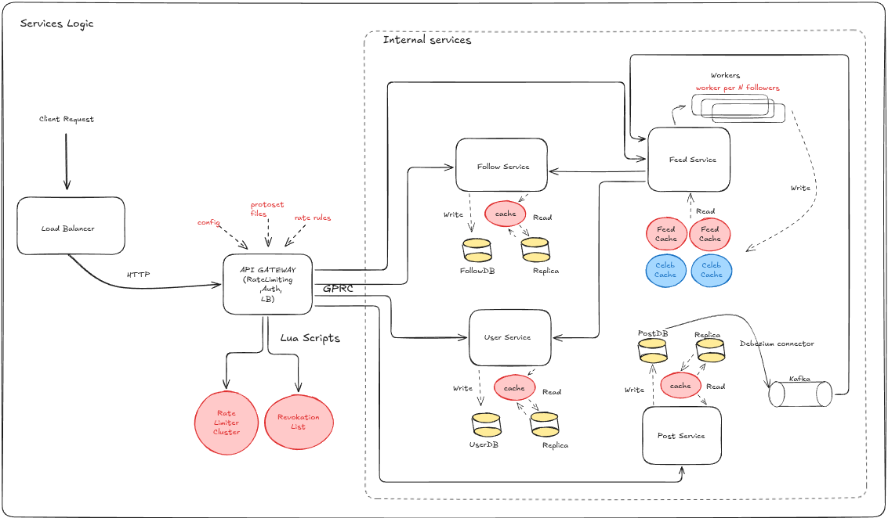
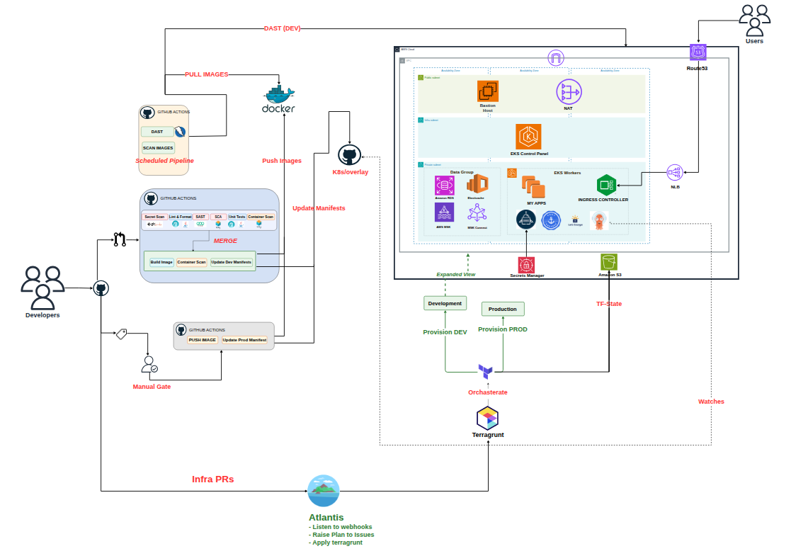

# Distributed Microservices Backend

A social media backend built from scratch to practice distributed systems design, cloud infrastructure, K8s and CI/CD. Services written in **Go** and **Spring Boot**, deployed on **AWS EKS** via **ArgoCD** with full GitOps.

---

**SERVICES ARCHITECTURE**


**INFRASTRUCTURE**


---

## Tech Stack

| Layer | Tools |
|---|---|
| **Services** | Go, Spring Boot, gRPC, Kafka, Redis, PostgreSQL |
| **Infra** | AWS EKS, RDS, ElastiCache, MSK, Terraform + Terragrunt |
| **GitOps** | ArgoCD, GitHub Actions |
| **Security** | IRSA, External Secrets Operator, Cert-Manager, SAST/DAST |

---

## Services

- `api_gateway` : rate limiting (Redis + Lua), JWT auth, dynamic HTTP→gRPC routing via protoset reflection
- `post_service` : posts, likes, comments; CDC (Debezium) → Kafka outbox; RDS primary/replica split reads
- `feed_service` : hybrid fan-out: write for normal users, read for celebrities; Redis sorted sets for cursor-based pagination
- `follow_service` : follower lists, celebrity threshold detection
- `user_service` : registration, login, JWT issuance

---

## CI/CD Pipeline

| Trigger | Jobs |
|---|---|
| **PR** | Secret scan, lint, SAST, SCA, unit tests, pre-merge image scan |
| **Post-merge** | Deep image scan, build & push, update dev overlay → ArgoCD deploys |
| **Scheduled** | DAST on dev, full registry image scan |
| **Tag** | Pull image by SHA, retag, manual gate, update prod manifests |
| **Infra (Atlantis)** | `terragrunt plan` on PR, `terraform apply` before merge |


> NOTE: ArgoCD CLI is used to ensure the sync and success of deployments. If anything fails, deployment pipelines will fail, providing an indicator to developers that something is wrong. For users, the K8s Deployment rollout strategy, using liveness and readiness probes, will indicate issues while keeping traffic routed to the previous deployment. Rollbacks for serious issues can be handled with a git revert + ArgoCD for now. 
---

## Key Design Decisions

- **API Gateway : dynamic HTTP→gRPC routing**

Instead of a hardcoded handler per endpoint, the gateway reads compiled `.protoset` files to build two maps: a *service map* (input/output types per method) and a *route map* (`google.api.http` annotations → gRPC method). Any new endpoint is handled automatically by adding it to the proto file.

- **Rate Limiting : Token Bucket over Redis with Lua**

Token Bucket chosen over Leaky Bucket (blocks bursts, bad UX) and Sliding Window (more memory per key). Multi-step Redis operations run as a single Lua script to avoid race conditions between concurrent gateway instances, as each script executes atomically on the server :)


> While in a prod. setup there are nore mature Gateways, building a custom API gateway from scratch was worth it for me even it is not the best yet .it walks through important concepts breifly like rate limiting, authentication and HTTP → gRPC translation.

**Feed Service : hybrid fan-out**

- Fan-out on write for regular users: workers batch followers (100/batch) and push post IDs into their feed caches. 
- Fan-out on read for celebrities: skip the write-time push, pull from celeb cache on request instead.

Benchmark result for fan-out write workers (5000 followers, mocked I/O):
```
Benchmark_SingleWorker_5000Followers                    1    5312748326 ns/op
Benchmark_100PerWorker_5000Followers                   10     107598250 ns/op   (~49x faster)
```

> Actually , These results are not something new, It is a classic I/O bound Issue that concurrency/parallelism can help with

**Post Counters : cache-first to avoid hot key contention**

Hot posts create a hot key on `likes_count` in Postgres : every like acquires a row lock. So, ccounters moved to Redis (atomic INCR), synced back to DB in batches every N minutes (Keep in mind this is still a hot key problem, but now it is on Cache Key which are faster and scalable than DB one).

**CDC over manual outbox**

`CreatePost → write DB → stream to Kafka` : risks consistency if Kafka write fails. So instead, write to DB only, Debezium reads WAL via a logical replication slot and streams to Kafka. DB is the single source of truth, Good with a trade-off as Debezium connector infra overhead.

**Terragrunt over Terraform workspaces**

Terragrunt hierarchical hcl files allow `dev/prod` to inherit common configuration (backend, provider, tags) and override only what differs (e.g., instance sizes) (DRY pattern). This approach is highly scalable, not only for handling Dev and Prod environments, but also for expanding into per region environments if needed. while avoiding excessive configuration duplication. we inheret, modify the parent one, we are good.

**IRSA : per workload IAM roles**

Node IAM role shared by all pods is a large blast radius. IRSA maps each K8s `ServiceAccount` to a specific IAM role via OIDC federation, so cert-manager gets DNS permissions only, CNI gets VPC permissions only, etc :)

---

## Infrastructure Overview

- **VPC** : 3 subnet tiers per AZ: public (Bastion, NAT GW), private (apps, DBs), infra (EKS control plane)
- **EKS** : AWS VPC CNI (pods get real VPC IPs), cluster autoscaler
- **Secrets** : AWS Secrets Manager → External Secrets Operator → K8s Secrets
- **TLS** : cert-manager + Let's Encrypt, DNS-01 challenge via Route53
- **State** : RDS (PostgreSQL, primary + read replica), ElastiCache (Redis), MSK (Kafka + Debezium via MSK Connect)

Terraform modules in `terraform_modules/`, environment configs in `live/dev` and `live/prod` and atlantis(for Infra CI) live in `/atlantis`

---

## Running Cluster

```
ali-mohamed@Ali-PC:~$ kubectl get pods -A
NAMESPACE             NAME                                                       READY   STATUS    RESTARTS   AGE
argocd-ns             argo-cd-argocd-application-controller-0                    1/1     Running   0          7h54m
argocd-ns             argo-cd-argocd-applicationset-controller-65895f5c9-s6v4x   1/1     Running   0          7h54m
argocd-ns             argo-cd-argocd-dex-server-6f5cb74b88-kqhcs                 1/1     Running   0          7h54m
argocd-ns             argo-cd-argocd-notifications-controller-54b684f785-t98t4   1/1     Running   0          7h54m
argocd-ns             argo-cd-argocd-redis-7b5747f4bb-r27ln                      1/1     Running   0          7h54m
argocd-ns             argo-cd-argocd-repo-server-57cfb94c64-7lwvd                1/1     Running   0          7h54m
argocd-ns             argo-cd-argocd-server-77f8dc6fc6-fjw97                     1/1     Running   0          7h54m
cert-manager-ns       cert-manager-7cd8b48d94-5kgf4                              1/1     Running   0          8h
cert-manager-ns       cert-manager-7cd8b48d94-vnzdw                              1/1     Running   0          8h
cert-manager-ns       cert-manager-cainjector-54898fcd57-dpglw                   1/1     Running   0          8h
cert-manager-ns       cert-manager-webhook-645bf4876d-jgkwr                      1/1     Running   0          8h
dmb                   api-gateway-bd45fc76-bkdxj                                 1/1     Running   0          7h33m
dmb                   api-gateway-bd45fc76-kzspl                                 1/1     Running   0          7h33m
dmb                   feed-service-6d94bd4874-87fhd                              1/1     Running   0          7h2m
dmb                   feed-service-6d94bd4874-nf5gx                              1/1     Running   0          7h2m
dmb                   follow-service-54498994fd-csf4d                            1/1     Running   0          7h2m
dmb                   follow-service-54498994fd-rkcgs                            1/1     Running   0          7h2m
dmb                   post-service-6fc6dbc887-78kwj                              1/1     Running   0          7h2m
dmb                   post-service-6fc6dbc887-h7p7v                              1/1     Running   0          7h2m
dmb                   user-service-5ccbd976cd-k67l6                              1/1     Running   0          7h48m
dmb                   user-service-5ccbd976cd-pkt74                              1/1     Running   0          7h48m
external-secrets-ns   external-secrets-864f984f5c-8dlc8                          1/1     Running   0          8h
external-secrets-ns   external-secrets-864f984f5c-vmxsh                          1/1     Running   0          8h
external-secrets-ns   external-secrets-cert-controller-f8f6f77dc-5rkjf           1/1     Running   0          8h
external-secrets-ns   external-secrets-webhook-75f7674949-lq772                  1/1     Running   0          8h
ingress-nginx-ns      ingress-nginx-controller-65bf679545-496sd                  1/1     Running   0          8h
ingress-nginx-ns      ingress-nginx-controller-65bf679545-n5svc                  1/1     Running   0          8h
kube-system           aws-node-bmbsr                                             2/2     Running   0          8h
kube-system           aws-node-gvkgl                                             2/2     Running   0          8h
kube-system           aws-node-lltpw                                             2/2     Running   0          8h
kube-system           aws-node-wx5z9                                             2/2     Running   0          8h
kube-system           coredns-5c5659b4b4-b7jch                                   1/1     Running   0          8h
kube-system           coredns-5c5659b4b4-xp5g9                                   1/1     Running   0          8h
kube-system           kube-proxy-g6mln                                           1/1     Running   0          8h
kube-system           kube-proxy-hzmgz                                           1/1     Running   0          8h
kube-system           kube-proxy-v92kv                                           1/1     Running   0          8h
kube-system           kube-proxy-w899j                                           1/1     Running   0          8h
```

---

## Future Work
- [x] CI pipeline for infra changes
- [ ] Database migration tooling
- [ ] ArgoCD Image Updater for automated image tag sync
